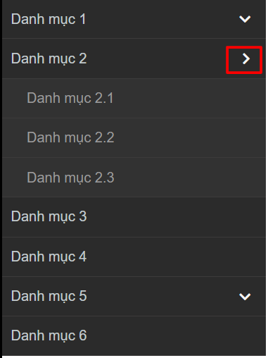
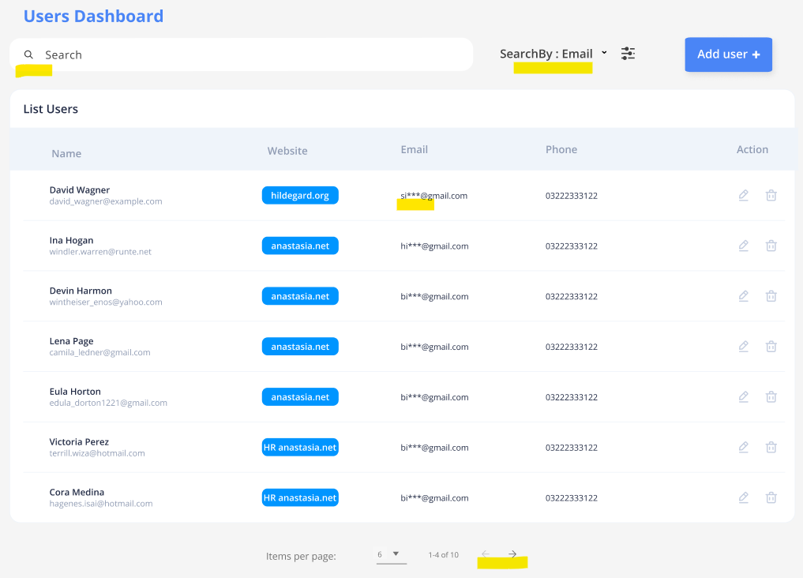

# Đề bài

- Bài 1 (Thuật toán):  Cho mảng dữ liệu ``menu`` trong đường dẫn ``./src/data.ts `` hãy xây dựng một menu đa cấp như sau 

- Bài 2 (Làm việc với API): Sử dụng api ở địa chỉ ``https://jsonplaceholder.typicode.com/users`` , hãy build datagrid sau :

>  hãy hoàn thiện các chức năng (được bôi vàng)
>  các tham số được bảo toàn khi refresh

#Lưu ý: không khuyến khích sử dụng thư viện ngoài, không quan trọng css